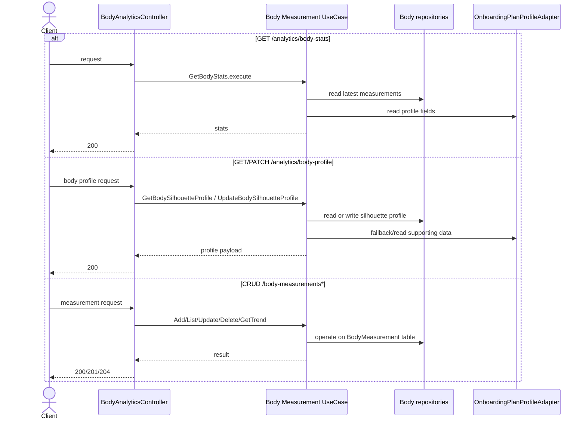
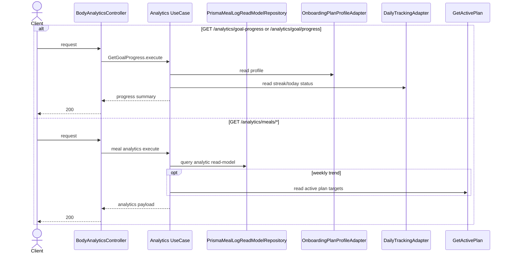
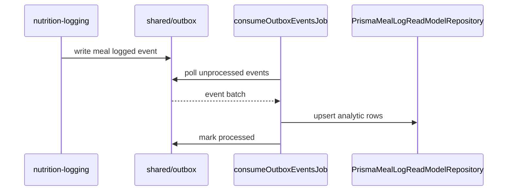

# Body Analytics Modulu Developer Doc

Bu modul vucut olcumleri, silhouette profili ve meal read-model uzerinden analitik endpointler sunar. Yogun okumaya optimize edilmis bir read-model ve moduller arasi adaptorler uzerinden calisir.

## Mimari Ozeti

- `http/BodyAnalyticsController.ts` body stats, trend ve meal analytics endpointlerini expose eder.
- `use-cases/` altinda iki ana grup vardir: body measurement odakli akislari ve meal analytics odakli akislari.
- `ports/` katmani profile, plan target, daily tracking, insight generator ve read-model bagimliliklarini soyutlar.
- `adapters/repository/` Prisma ile `BodyMeasurement`, `BodySilhouetteProfile` ve `MealLogReadModel` tablolarini okur/yazar.
- `jobs/consumeOutboxEventsJob.ts` nutrition logging outbox event'lerinden analytic read-model'i besler.

## Endpointler

| Method | Path | Aciklama |
| --- | --- | --- |
| `GET` | `/analytics/body-stats` | Son olcumler ve ozet body stats |
| `GET` | `/analytics/body-profile` | Silhouette profili (bir bolge duzenlenmediyse onboarding'de girilen olcuye fallback eder) |
| `PATCH` | `/analytics/body-profile` | Silhouette profilini gunceller |
| `GET` | `/analytics/waist-height-ratio` | Bel-boy oranini hesaplar |
| `GET` | `/analytics/goal-progress` | Goal progress ozeti |
| `GET` | `/analytics/goal/progress` | Goal progress alias endpoint'i |
| `GET` | `/analytics/meals/averages` | Ortalama meal macros |
| `GET` | `/analytics/meals/weekly` | Haftalik meal trendi |
| `GET` | `/analytics/meals/breakdown` | Macro/meal dagilimi |
| `GET` | `/analytics/meals/top-foods` | En sik yiyecekler |
| `GET` | `/analytics/meals/insights` | Insight uretimi |
| `GET` | `/analytics/meals/correlation` | Meal ve body olcum korelasyonu |
| `GET` | `/body-measurements` | Olcum listesi |
| `POST` | `/body-measurements` | Yeni olcum ekler |
| `GET` | `/body-measurements/trend` | Trend hesabi |
| `PATCH` | `/body-measurements/:id` | Olcumu gunceller |
| `DELETE` | `/body-measurements/:id` | Olcumu siler |

## Sequence Diagramlari

### Body profile ve measurement endpointleri



### Goal progress ve meal analytics endpointleri



### Read-model besleme akisi



## Gelistirme Rehberi

- Yeni analytics endpoint'i ekliyorsaniz once bunun transactional source of truth'tan mi yoksa read-model'den mi okunmasi gerektigini secin. Tekrarlanan toplu sorgular icin read-model tercih edin.
- `body-analytics` diger modullerin tablolarina direkt gitmemeli. `ProfilePort`, `DailyTrackingPort`, `PlanTargetPort` gibi portlar uzerinden gidin.
- Insight uretimi adapter uzerinden soyutlanmis. LLM tabanli generator eklerken use-case imzasini degistirmeyin; `InsightGeneratorPort` implement edin.
- Kullaniciya donen metinler (insight `title`/`body` vb.) `Accept-Language`'e gore uretilir. Controller `getLocale(req)` ile `Locale` cozer, `GetMealInsights` bunu generator'a gecirir; bilinmeyen etiketlerde `en`'e duser.

## Ornek Best Practice

Dogru:

```ts
const insights = await insightGenerator.generate(logs, locale);
```

Yanlis: `GetMealInsights` icinde dogrudan LLM client olusturmak veya `nutrition-logging` repository import etmek.
