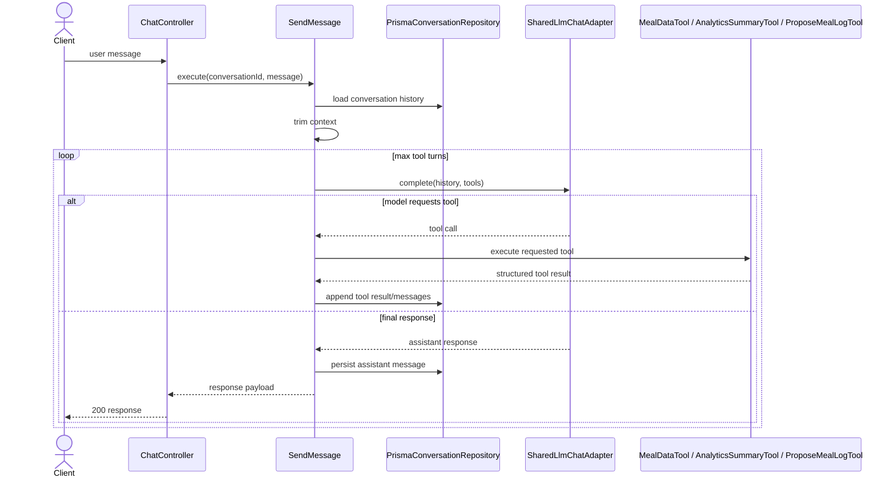
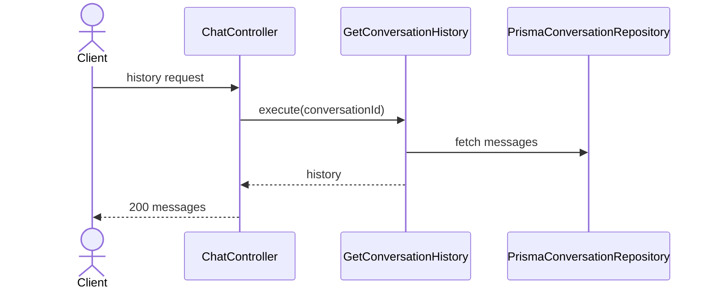
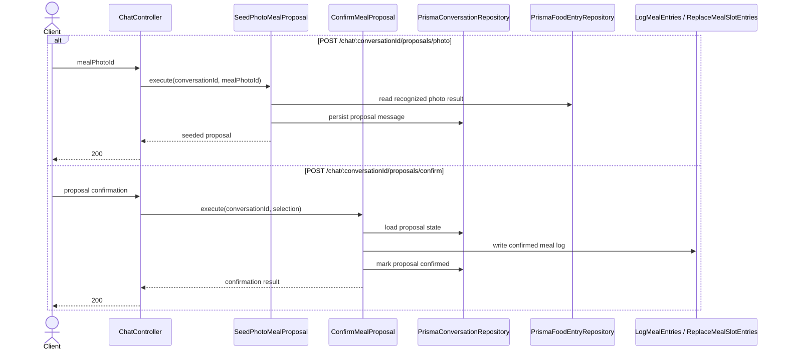

# Chatbot Modulu Developer Doc

Bu modul LLM tabanli konusma deneyimini, tool-calling ile repo icindeki diger modullere baglayarak sunar. Maliyet ve kontrol riskleri nedeniyle en sik guardrail gerektiren modul budur.

## Mimari Ozeti

- `http/ChatController.ts` chat endpointlerini expose eder.
- `use-cases/SendMessage.ts` ana orchestration akisidir; conversation history okur, tool loop yapar ve son cevabi uretir.
- `use-cases/tools/` altindaki kopruler chatbot'un diger modullere hangi sinirdan erisecegini belirler.
- `ports/LlmChatPort.ts` ve `adapters/llm/SharedLlmChatAdapter.ts` provider-agnostic LLM erisimini saglar.
- `adapters/repository/PrismaConversationRepository.ts` mesaj gecmisini ve meal proposal durumunu saklar.

## Endpointler

| Method | Path | Aciklama |
| --- | --- | --- |
| `POST` | `/chat/:conversationId/messages` | Mesaj gonderir, gerekirse tool kullanarak cevap uretir |
| `GET` | `/chat/:conversationId` | Konusma gecmisini getirir; yoksa bos conversation olusturup dondurur |
| `POST` | `/chat/:conversationId/proposals/photo` | Food photo sonucundan meal proposal seed eder |
| `POST` | `/chat/:conversationId/proposals/confirm` | Meal proposal'i nutrition logging'e yazar |

## Sequence Diagramlari

### `POST /chat/:conversationId/messages`



### `GET /chat/:conversationId`



### Proposal endpointleri



## Gelistirme Rehberi

- Yeni tool ekleyecekseniz once `use-cases/tools/` altinda net input/output sozlesmesi olan bir bridge yazin; chatbot dosyalarindan diger modullerin repository'lerini direkt import etmeyin.
- `MAX_TOOL_TURNS`, rate limit ve context trimming guardrail'lerini gevsetmeyin. Bu modulde maliyet ve latency kontrolu is mantigi kadar onemli.
- LLM sonucunu her zaman validate edin. Structured output veya tool response parse islemini adapter/use-case sinirinda tutun.

## Ornek Best Practice

Dogru:

```ts
const sendMessage = new SendMessage(llmChatPort, conversationRepo, [toolA, toolB], maxTurns, maxContext);
```

Yanlis: controller icinde LLM client cagirip tool orkestrasyonunu orada yapmak.
