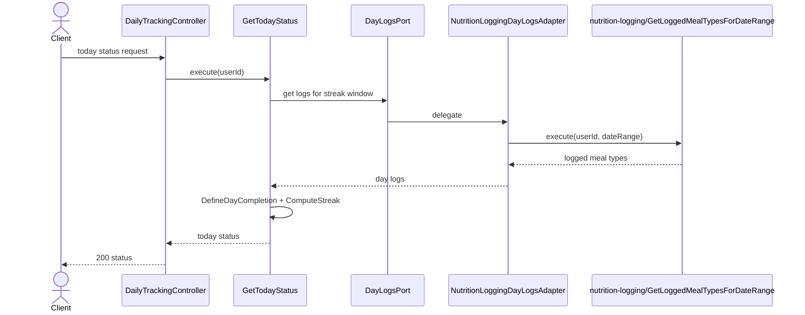
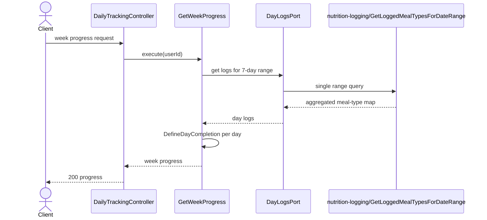

# Daily Tracking Modulu Developer Doc

Bu modul nutrition log verisini yorumlayarak gunluk durum ve haftalik ilerleme sunar. Kendi tablosu yoktur; salt okunur bir turetilmis gorunum olarak calisir.

## Mimari Ozeti

- `http/DailyTrackingController.ts` iki read endpoint'ini sunar.
- `use-cases/GetTodayStatus.ts` ve `GetWeekProgress.ts` sonuc objelerini uretir.
- `ports/DayLogsPort.ts` hangi gunlerde hangi meal type'larin loglandigini soyutlar.
- `adapters/dayLogs/NutritionLoggingDayLogsAdapter.ts` `nutrition-logging/GetLoggedMealTypesForDateRange` use-case'ine kopru olur.
- `domain/DefineDayCompletion.ts` ve `ComputeStreak.ts` urun kuralini ve saf algoritmayi ayri tutar.

## Endpointler

| Method | Path | Aciklama |
| --- | --- | --- |
| `GET` | `/tracking/today-status` | Bugunun tamamlanma durumu ve streak bilgisini doner |
| `GET` | `/tracking/week-progress` | Haftalik gun tamamlama haritasini doner |

## Sequence Diagramlari

### `GET /tracking/today-status`



### `GET /tracking/week-progress`



## Gelistirme Rehberi

- Yeni bir streak veya completion kurali ekleyecekseniz `DefineDayCompletion` icinde urun kararini, `ComputeStreak` icinde algoritmayi ayri tutun.
- Bu modula tablo eklemeyin; once ayni sonuc mevcut meal log verisinden turetilebiliyor mu bakin.
- Performans degisikliginde hedefiniz range-based query olmali. Gun gun N sorgu atan implementasyonlardan kacin.

## Ornek Best Practice

Dogru:

```ts
const logs = await dayLogsPort.getLoggedMealTypes(userId, from, to);
return ComputeStreak(logs.map(DefineDayCompletion));
```

Yanlis: her gun icin ayri repository sorgusu atmak veya completion sonucunu DB'de materialize etmek.
