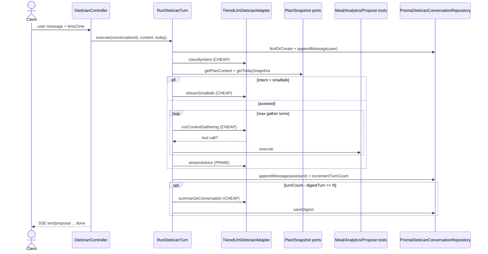

# Dietician Modulu Developer Doc

Bu modul, chatbot'un aksine **hedef odakli bir koclama** deneyimi sunar: her cevabi
kullanicinin plani (kalori/makro hedefi), trendi ve o gun yedikleriyle iliskilendirir.
Iki model katmani kullanir — mekanik is icin ucuz model, asil tavsiye icin pahali
("prime") model.

## Mimari Ozeti

- `http/DieticianController.ts` SSE endpointlerini expose eder.
- `use-cases/RunDieticianTurn.ts` ana orchestration akisidir (chatbot'un `SendMessage`
  karsiligi): siniflandirma -> (smalltalk | veri toplama + sentez) -> tur sonrasi digest.
- `ports/LlmDieticianPort.ts` + `adapters/llm/TieredLlmDieticianAdapter.ts` iki katmanli
  LLM erisimini saglar. Bu modulde `shared/llm/`'e dokunan TEK dosya adapter'dir.
- `adapters/context/` altindaki kopruler plan ve gunluk ozet verisini diger modullerin
  public use-case'lerinden okur.
- `use-cases/tools/` altindaki kopruler tool-calling sirasinda diger modullere erisimi
  belirler (chatbot'takiyle ayni desen, ayri dosyalar).
- `adapters/repository/PrismaDieticianConversationRepository.ts` mesaj gecmisini ve
  rolling digest'i saklar.

## Endpointler

| Method | Path | Aciklama |
| --- | --- | --- |
| `POST` | `/dietician/:conversationId/messages` | Mesaj gonderir; SSE ile cevap akitir (`text` / `proposal` / `thinking` / `done` / `error`) |
| `GET` | `/dietician/:conversationId` | Konusma gecmisi + header (plan + bugunku ozet); yoksa bos conversation olusturur |
| `POST` | `/dietician/:conversationId/proposals/confirm` | Meal proposal'i nutrition-logging'e yazar |

`POST .../messages` ve `GET .../:id` body/query'de `timeZone` bekler (kullanicinin yerel
gunu = bugunku ozet icin).

## Sequence — `POST /dietician/:conversationId/messages`

## Model katmanlari ve maliyet

- `dietician:classify` / `dietician:gather` / `dietician:smalltalk` / `dietician:digest`
  -> `LLM_MODEL_CHEAP`
- `dietician:advice` -> `LLM_MODEL_PRIME` (TEK prime cagrisi, sadece sentez turunda)
- Her cagri `feature` etiketiyle `llm_tokens_total`'a yazilir; dashboard'da dietician
  maliyeti asama asama ayrilir.
- Free kullanici gunluk kotasi (`FREE_DAILY_DIETICIAN_LIMIT`) chat'ten dusuk — her advice
  turu bir prime completion harcar.

## Gelistirme Rehberi

- Bkz. `dietician-rule.md`.
- Yeni tool: `use-cases/tools/` altinda net input/output sozlesmeli bir bridge yazin,
  diger modullerin repository'lerini import ETMEYIN.
- `DIETICIAN_MAX_GATHER_TURNS`, rate limit ve context trimming guardrail'lerini gevsetmeyin.
- LLM ciktisi her zaman `shared/llm/structuredOutput` ile parse edilir (intent + digest).
