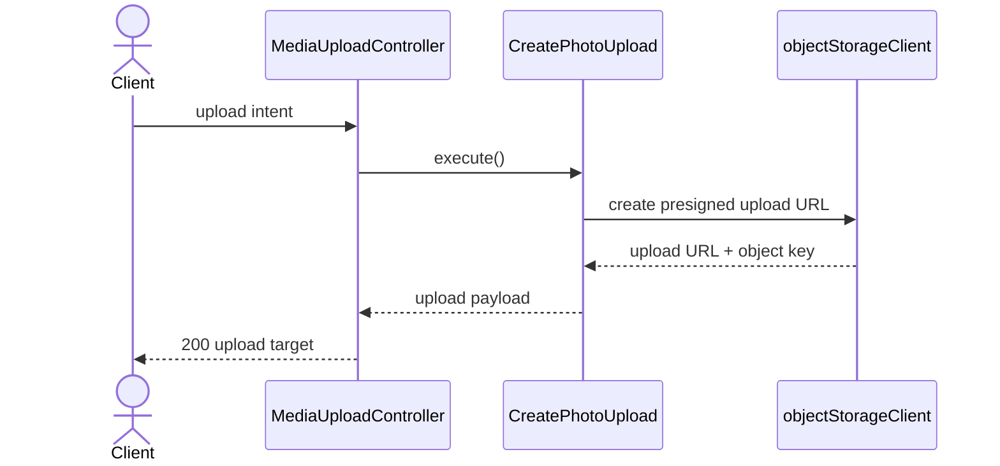
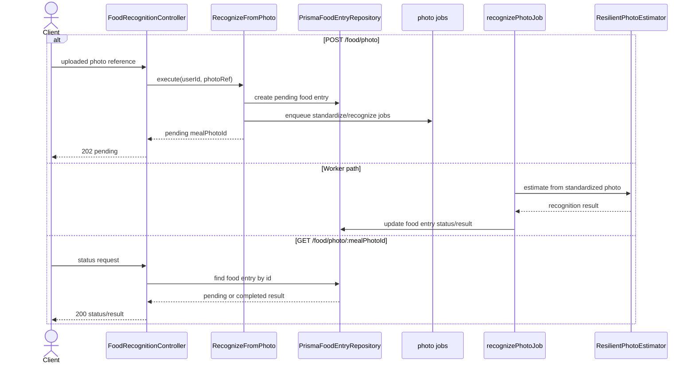
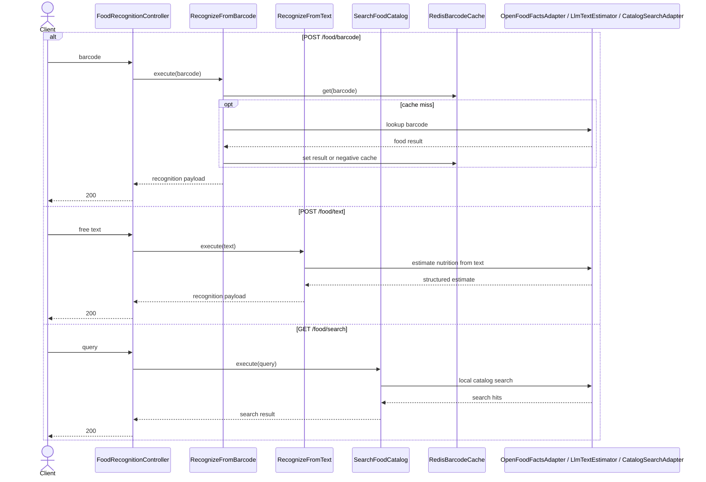

# Food Recognition Modulu Developer Doc

Bu modul fotograf, barcode, text ve katalog arama akislariyla yiyecek tanima saglar. Senkron ve asenkron akislarin birlikte bulundugu, en fazla dis entegrasyon tasiyan moduldur.

## Mimari Ozeti

- `http/FoodRecognitionController.ts` ve `MediaUploadController.ts` public HTTP yuzeyini saglar.
- `use-cases/` tanima akislari ve upload hazirligi icin uygulama servislerini barindirir.
- `ports/` barkod lookup, text/photo estimator, barcode cache ve repository sozlesmelerini tanimlar.
- `adapters/photo/`, `adapters/barcode/`, `adapters/text/`, `adapters/search/`, `adapters/repository/` dis kaynaklari ve DB'yi soyutlar.
- `jobs/recognizePhotoJob.ts` ve `jobs/standardizeAndCopyJob.ts` foto akisinin worker tarafini tasir.

## Endpointler

| Method | Path | Aciklama |
| --- | --- | --- |
| `POST` | `/media/upload` | Photo upload icin presigned URL uretir |
| `POST` | `/food/photo` | Asenkron foto recognition istegi baslatir |
| `GET` | `/food/photo/:mealPhotoId` | Foto recognition durumunu sorgular |
| `POST` | `/food/barcode` | Barcode'dan tanima yapar |
| `POST` | `/food/text` | Text'ten nutrition estimate uretir |
| `GET` | `/food/search` | Lokal katalogda arama yapar |

## Sequence Diagramlari

### `POST /media/upload`



### Foto recognition akisi



### Senkron tanima endpointleri



## Gelistirme Rehberi

- Yeni tanima kaynagi eklerken once port acin, sonra adapter yazin. Use-case icine provider SDK veya HTTP client kodu gommekten kacinin.
- Barcode/text/search senkron akislarinda gereksiz DB persist etmeyin; photo akisi disinda repository sadece asenkron state icin kullaniliyor.
- Photo pipeline'da worker idempotency ve status gecisleri korunmali. Yeni job eklerken `pending -> processing -> completed/failed` semantigini bozmamaya dikkat edin.

## Ornek Best Practice

Dogru:

```ts
const photoEstimator = new ResilientPhotoEstimator(new RagHttpEstimator());
```

Yanlis: `RecognizeFromText` icinde dogrudan OpenAI client yaratmak veya barcode sonucunu her istekte DB'ye yazmak.
