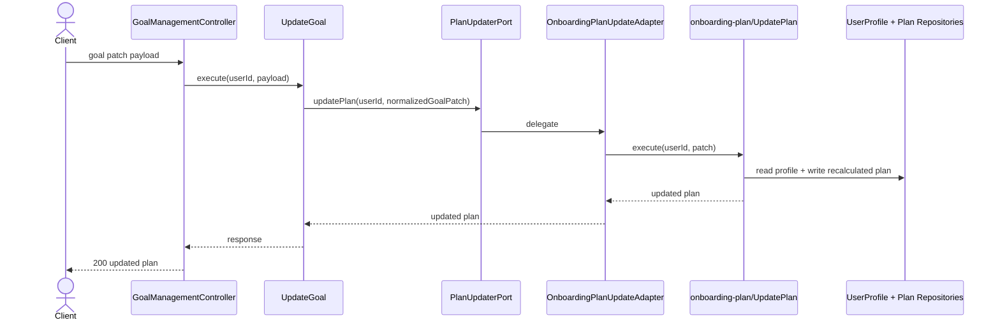

# Goal Management Modulu Developer Doc

Bu modul kullanicinin hedef degistirme akisini tek bir HTTP yuzeyi olarak sunar. Kendisi veri sahibi degildir; plan yeniden hesaplamasini `onboarding-plan` modulundeki yetkili use-case'e delege eder.

## Mimari Ozeti

- `http/GoalManagementController.ts` authenticated request'i `UpdateGoal` use-case'ine yonlendirir.
- `use-cases/UpdateGoal.ts` hedef degisikligi istegini normalize eder.
- `ports/PlanUpdaterPort.ts` bu modulin baska modulu nasil cagiracagini tanimlar.
- `adapters/plan/OnboardingPlanUpdateAdapter.ts` `onboarding-plan/UpdatePlan` use-case'ine kopru olur.

## Endpointler

| Method | Path | Aciklama |
| --- | --- | --- |
| `PATCH` | `/goal` | Kullanici hedefini ve buna bagli planini gunceller |

## Sequence Diagramlari

### `PATCH /goal`



## Gelistirme Rehberi

- Bu modulde yeni is kurali eklemeden once bunun gercekten ayri bir hedef akisi olup olmadigini sorgulayin. Sadece plan hesabini etkileyen bir degisiklikse `onboarding-plan` tarafina gitmelidir.
- `UpdateGoal` icine repository enjekte etmeyin. Bu modulun degeri yazma sahipligini tek noktada toplamasidir.
- Hedef patch schema'si buyurse bile normalized DTO'yu kucuk tutun; farkli UI alanlarini domain alanlarina controller/use-case sinirinda map edin.

## Ornek Best Practice

Dogru:

```ts
await updateGoal.execute(userId, {
  goal: "lose",
  weeklyPaceKg: 0.5,
});
```

Yanlis: `goal-management` icinde `PlanCalculationService` cagirip `Plan` tablosuna kendiniz yazmak.
