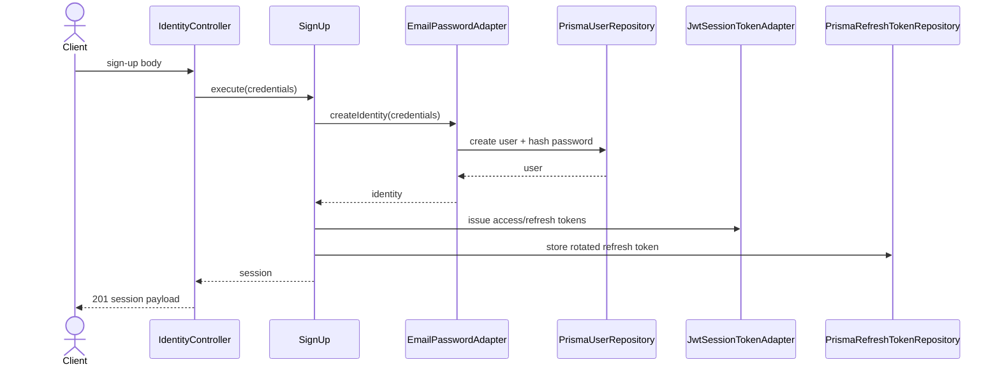
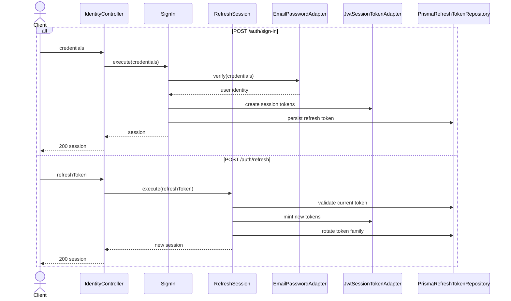
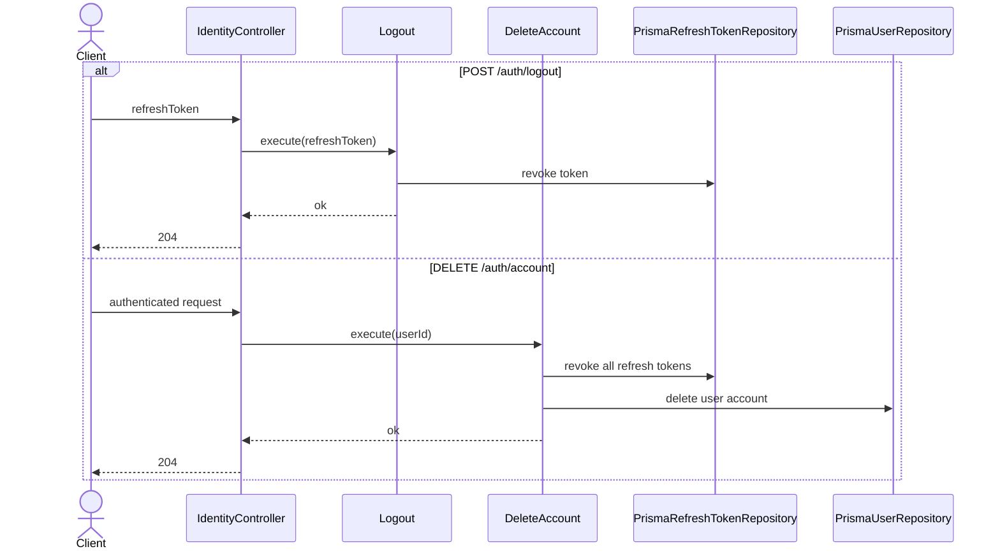

# Identity Modulu Developer Doc

Bu modul kullanici kimligini dogrular, session token uretir, refresh token rotation yapar ve hesabi siler. Kod yapisi klasik `http -> use-case -> port -> adapter` zincirini izler.

## Mimari Ozeti

- `http/IdentityController.ts` request validation ve HTTP mapping yapar.
- `use-cases/` altinda `SignUp`, `SignIn`, `RefreshSession`, `Logout`, `DeleteAccount` bulunur.
- `ports/` katmani token uretimi, refresh token saklama ve identity provider sozlesmelerini tanimlar.
- `adapters/repository/` Prisma ile kaliciligi; `adapters/token/` JWT uretimini; `adapters/provider/` provider bazli kimlik dogrulamayi uygular.

## Endpointler

| Method | Path | Aciklama |
| --- | --- | --- |
| `POST` | `/auth/sign-up` | Email+sifre ile hesap acip ilk session'i uretir |
| `POST` | `/auth/sign-in` | Email+sifre ile oturum acar |
| `POST` | `/auth/refresh` | Refresh token rotation ile yeni session verir |
| `POST` | `/auth/logout` | Refresh token'i iptal eder |
| `DELETE` | `/auth/account` | Authenticated kullanicinin hesabini ve sessionlarini siler |

## Sequence Diagramlari

### `POST /auth/sign-up`



### `POST /auth/sign-in` ve `POST /auth/refresh`



### `POST /auth/logout` ve `DELETE /auth/account`



## Gelistirme Rehberi

- Yeni provider ekleyecekseniz `IdentityProviderPort` implement edin; `SignIn` veya `RefreshSession` icine provider ozel kod koymayin.
- Refresh token akisini atlamayin. Session ile ilgili her yeni davranis `RefreshTokenRepositoryPort` uzerinden revoke/rotate mantigina uymali.
- Request validation controller'da `zod` ile yapiliyor. Use-case icine ham `req.body` tasimayin.
- Hesap silme, cikis ve refresh gibi kritik akislarda repository bypass etmeyin; tum silme/iptal islemleri use-case uzerinden gecmeli.

## Ornek Best Practice

Yeni bir social login eklerken dogru pattern:

```ts
class AppleSignInAdapter implements IdentityProviderPort {
  async verify(credentials: AppleCredentials) {
    return { externalId, email };
  }
}
```

Yanlis pattern: controller icinde provider SDK cagirmak veya `PrismaUserRepository`'yi dogrudan route dosyasindan degistirmek.
