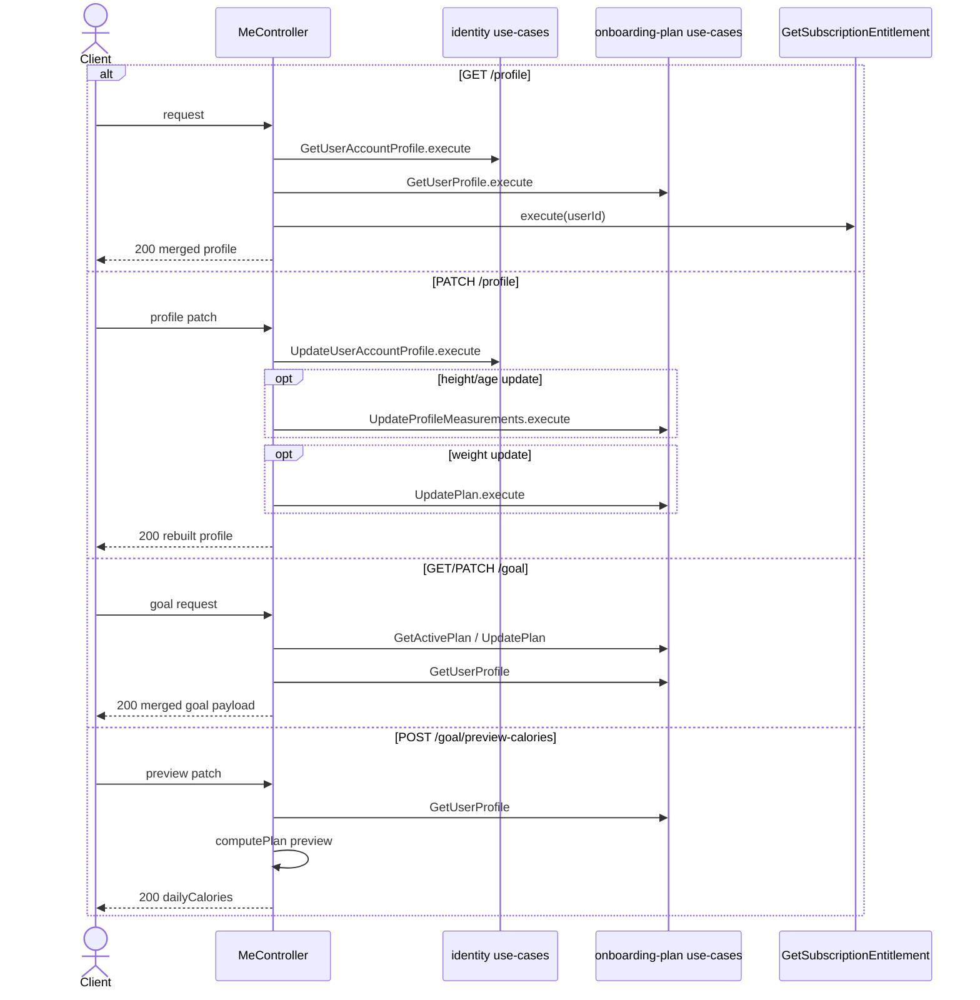
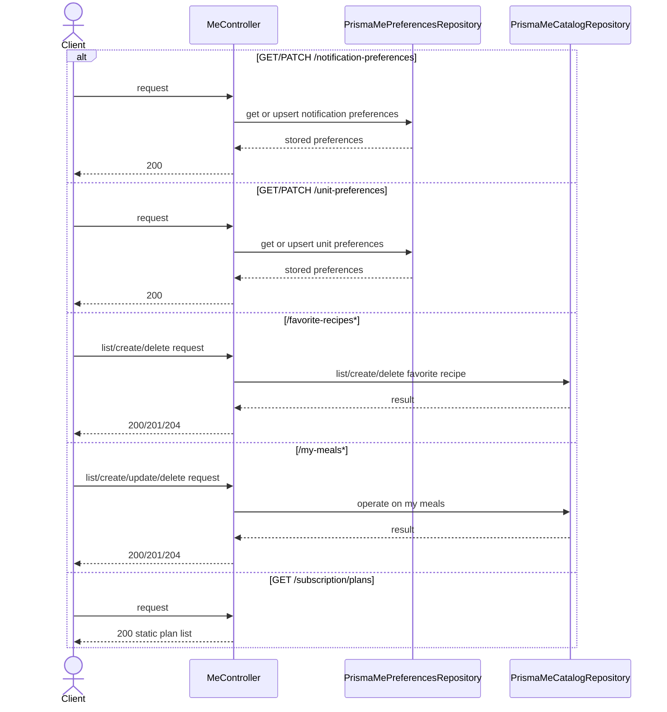

# Me Modulu Developer Doc

Bu modul mobil uygulamanin profil, goal, tercih ve kisisel katalog ekranlarini tek yerde toplar. Cekirdek mantigi kendisi uretmek yerine birden fazla modulu orkestre eder.

## Mimari Ozeti

- `http/MeController.ts` request validation, DTO mapping ve response composition yapar.
- Kimlik verisi `identity`, hedef ve profil verisi `onboarding-plan`, premium bilgisi `subscription` modulunden okunur.
- `ports/MeCatalogRepositoryPort.ts` ve `MePreferencesRepositoryPort.ts` sadece bu modulun sahip oldugu katalog/preference kaliciligini soyutlar.
- `adapters/repository/` altindaki Prisma repository'ler favorite recipes, my meals ve preference verilerini saklar.

## Endpointler

| Method | Path | Aciklama |
| --- | --- | --- |
| `GET` | `/profile` | Birlesik profil cevabi |
| `PATCH` | `/profile` | Profil alanlarini gunceller |
| `GET` | `/goal` | Birlesik hedef cevabi |
| `PATCH` | `/goal` | Hedefi gunceller |
| `POST` | `/goal/preview-calories` | Yeni hedef icin tahmini kalori preview |
| `GET` | `/notification-preferences` | Bildirim tercihleri |
| `PATCH` | `/notification-preferences` | Bildirim tercihlerini gunceller |
| `GET` | `/unit-preferences` | Unit tercihleri |
| `PATCH` | `/unit-preferences` | Unit tercihlerini gunceller |
| `GET` | `/favorite-recipes` | Favori tarif listesi |
| `POST` | `/favorite-recipes` | Favori tarif ekler |
| `DELETE` | `/favorite-recipes/:id` | Favori tarif siler |
| `GET` | `/my-meals` | Kullanicinin kaydettigi meal listesi |
| `POST` | `/my-meals` | Kisisel meal ekler |
| `PATCH` | `/my-meals/:id` | Kisisel meal gunceller |
| `DELETE` | `/my-meals/:id` | Kisisel meal siler |
| `GET` | `/subscription/plans` | Statik subscription plan katalogu |

## Sequence Diagramlari

### Profil ve goal endpointleri



### Preferences ve katalog endpointleri



## Gelistirme Rehberi

- `me` modulunu business source of truth'a cevirmeyin. Bu modulun gorevi birlesik mobile-facing response olusturmak.
- Profil/goal patch endpointlerinde alanlar farkli sahip modullere dagiliyor. Yeni alan eklerken once owner modulunu belirleyin, sonra `MeController` sadece orkestrasyon yapsin.
- Preferences ve user catalog verileri bu modulun kendi sahipligi altinda; yeni preference turleri ekliyorsaniz `MePreferencesRepositoryPort` uzerinden ilerleyin.

## Ornek Best Practice

Dogru:

```ts
const [account, profile, isPremium] = await Promise.all([
  getUserAccountProfile.execute(userId),
  getUserProfile.execute(userId),
  getSubscriptionEntitlement.execute(userId),
]);
```

Yanlis: profil response'u olustururken farkli modullerin Prisma repository'lerini controller icinde dogrudan okuyup sahiplik sinirlarini bozmak.
