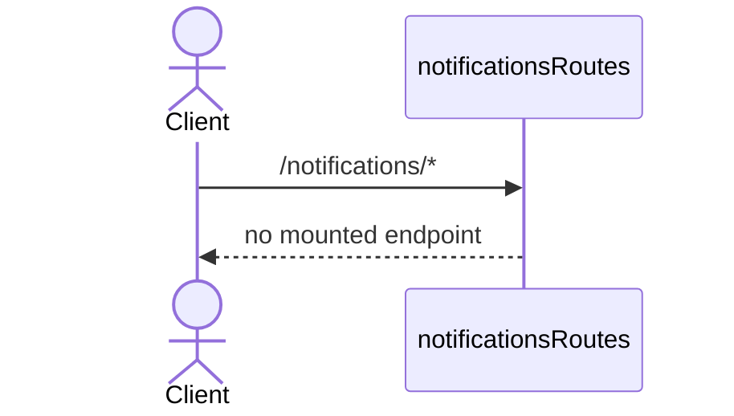
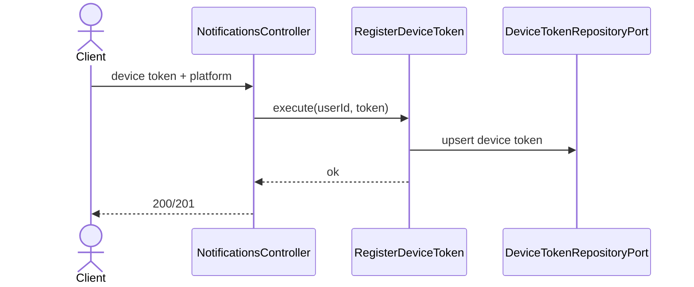
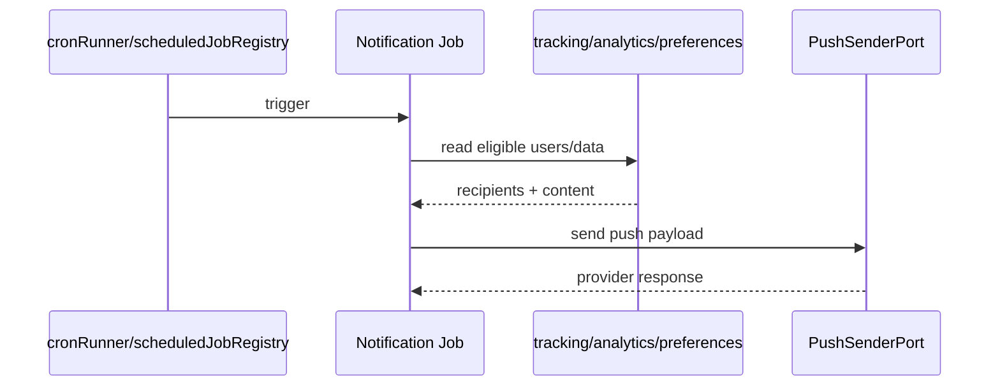

# Notifications Modulu Developer Doc

Bu modul su anda tam uygulanmamis durumda. Buna ragmen hedeflenen mimari acik: cihaz token kaydi, kullanici tercihleriyle senkron push gonderimi ve zamanlanmis bildirim job'lari.

## Mimari Ozeti

- `http/notificationsRoutes.ts` su anda bos; public endpoint yok.
- `use-cases/RegisterDeviceToken.ts` cihaz token kaydinin uygulama servisi olacak.
- `ports/DeviceTokenRepositoryPort.ts` token kaliciligini, `PushSenderPort.ts` ise FCM/APNS gonderimini soyutlar.
- `adapters/repository/PrismaDeviceTokenRepository.ts`, `adapters/push/FcmPushAdapter.ts`, `ApnsPushAdapter.ts` kalicilik ve provider implementasyonlarini saglar.
- `jobs/` altinda meal reminder, streak saver ve weekly report background akislari icin placeholder dosyalar var.

## Endpointler

Su an router'a mount edilmis aktif bir endpoint yok. `notificationsRoutes()` bos donuyor.

## Sequence Diagramlari

### Mevcut durum



### Hedeflenen device token kayit akisi



### Hedeflenen background job akislari



## Gelistirme Rehberi

- Bu modulu implement ederken ilk adim device token registration endpoint'ini bitirmek olmali; job'lar ondan sonra anlamli hale gelir.
- Push provider kodunu use-case veya job icine gommek yerine `PushSenderPort` arkasinda tutun. Ayni mesaj hem FCM hem APNS'e gidebilmeli.
- Notification tercihleri `me` modulunde tutuluyor. Job'lar bu tercihleri okuyup filtrelemeli; kendi preference kopyalarini olusturmayin.
- Streak saver ve weekly report gibi job'lar veri okumak icin `daily-tracking` ve `body-analytics` public use-case veya adaptorlerine gitmeli; repository kopyalamayin.

## Ornek Best Practice

Dogru:

```ts
await deviceTokenRepository.upsert({ userId, platform, token });
await pushSender.send({ tokens, title, body, data });
```

Yanlis: her job icinde APNS ve FCM request formatini elle kurup tekrar tekrar yazmak.
