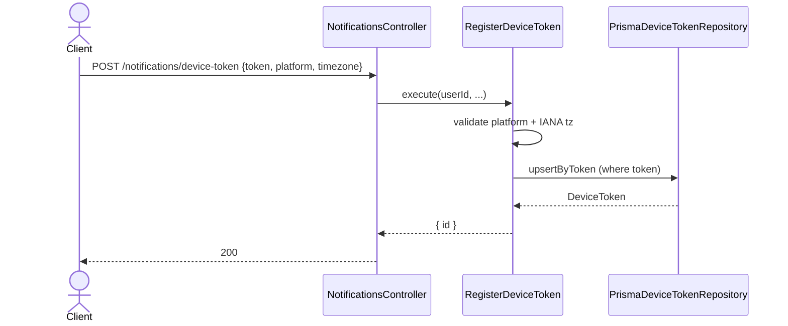
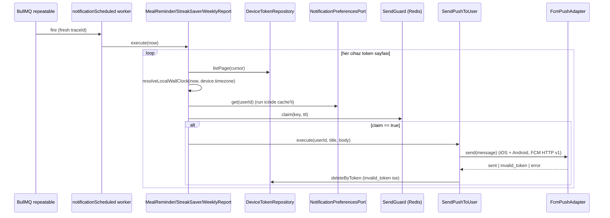

# Notifications Modulu — Developer Doc

Push bildirim altyapisi: cihaz token kaydi, saglayici-agnostik push gonderimi
ve kullanicinin yerel saatine gore calisan zamanlanmis bildirim job'lari.

Kurallar ve nuanslar icin `notifications-rule.md`.

## Mimari Ozeti

```
domain/
  DeviceToken.ts        — DevicePlatform + DeviceToken tipi
  localWallClock.ts     — instant + IANA tz -> {hour, minute, weekday, dateKey, isoWeekKey}
  matchReminderSlot.ts  — "HH:MM" hedefi 15 dk'lik yarim-acik slota giriyor mu
  NotificationCopy.ts   — en/tr lokalize {title, body} builder'lari

ports/
  DeviceTokenRepositoryPort   — upsertByToken / deleteByToken / listByUserId / listPage
  PushSenderPort              — send(PushMessage) -> sent | invalid_token | error
  NotificationPreferencesPort — me modulune kopru (read-only)
  DayCompletionPort           — daily-tracking'e kopru (streak saver)
  WeeklySummaryPort           — daily-tracking + body-analytics'e kopru (weekly report)

adapters/
  repository/PrismaDeviceTokenRepository
  push/FcmPushAdapter            — FCM HTTP v1, HER IKI platform (GoogleAuth/ADC + fetch)
  push/ApnsPushAdapter           — APNs HTTP/2 (node:http2 + jsonwebtoken ES256) — WIRE EDILMEDI
  push/PlatformRoutingPushSender — platform'a gore FCM/APNs secer — WIRE EDILMEDI
  preferences/MeNotificationPreferencesAdapter
  tracking/DailyTrackingCompletionAdapter
  summary/WeeklySummaryAdapter

use-cases/
  RegisterDeviceToken     — POST /notifications/device-token
  UnregisterDeviceToken   — DELETE /notifications/device-token
  SendPushToUser          — (internal) kullanicinin tum cihazlarina gonderir, olu token'lari budar

jobs/
  notificationScheduler   — 'notifications-scheduled' queue + worker + registerNotificationSchedules()
  MealReminderScheduler   — export class MealReminderJob   (her 15 dk)
  StreakSaverAlertJob     — export class StreakSaverAlertJob (her 30 dk)
  WeeklyReportJob         — export class WeeklyReportJob     (saat basi)
  SendGuard               — RedisSendGuard (SET NX EX) + MemoizingSendGuard
  deviceIteration         — paginateDevices() + PreferenceCache
```

## Endpointler

Ikisi de `authMiddleware` arkasinda; `userId` = `req.auth.userId`.

### `POST /notifications/device-token`

```jsonc
// request
{
  "token": "fcm-or-apns-token",
  "platform": "ios" | "android",
  "timezone": "Europe/Istanbul",   // IANA — dogrulanir
  "locale": "en" | "tr"            // opsiyonel; yoksa Accept-Language
}
// response 200
{ "id": "<device token row id>" }
```

Ayni `token` ile tekrar cagirmak satiri gunceller (owner/tz/locale tazelenir),
yeni satir acmaz.

### `DELETE /notifications/device-token`

```jsonc
{ "token": "fcm-or-apns-token" }   // -> 204, idempotent
```

Cikis (logout) veya cihazda bildirimler kapatildiginda cagrilir.

## Zamanlanmis Job'lar

`NOTIFICATIONS_ENABLED=true` degilse hicbiri kaydedilmez (`main.ts` acilista
`registerNotificationSchedules()` cagirir). Uc job da tum cihaz token'larini
sayfalar ve **her cihazin kendi saat dilimine** gore filtreler.

| Job | Cron | Kosul | Guard anahtari |
|---|---|---|---|
| `meal-reminders` | `*/15 * * * *` | `masterEnabled` + ilgili ogun acik + yerel saat `HH:MM` slotuna girdi | `meal:<userId>:<dateKey>:<meal>` |
| `streak-saver` | `*/30 * * * *` | `streakSaver` acik + yerel saat `STREAK_SAVER_LOCAL_HOUR` + gun tamamlanmadi + `currentStreak >= 1` | `streak:<userId>:<dateKey>` |
| `weekly-report` | `0 * * * *` | `weeklyReport` acik + yerel gun `WEEKLY_REPORT_WEEKDAY` + yerel saat `WEEKLY_REPORT_LOCAL_HOUR` | `weekly:<userId>:<isoWeekKey>` |

Gonderim `SendPushToUser` -> `FcmPushAdapter` uzerinden (iOS dahil; FCM APNs'e
relay eder) — kullanicinin TUM cihazlarina gider, saglayicinin `invalid_token`
dedigi satirlar silinir.

## Sequence — device token kayit



## Sequence — zamanlanmis job



## Env

`shared/config/env.ts` — hepsi opsiyonel; FCM kimligi `GoogleAuth` ile cozuldugu
icin `NOTIFICATIONS_ENABLED` iken bile zorunlu env YOK.

```
NOTIFICATIONS_ENABLED=false
# FCM kimligi (ilk eslesen): FCM_SERVICE_ACCOUNT_JSON -> GOOGLE_APPLICATION_CREDENTIALS
#   -> `gcloud auth application-default login` -> GCP metadata server
FCM_SERVICE_ACCOUNT_JSON=      FCM_PROJECT_ID=   (yoksa auth.getProjectId() cozer)
STREAK_SAVER_LOCAL_HOUR=21     WEEKLY_REPORT_WEEKDAY=1 (0=Paz..6=Cmt)   WEEKLY_REPORT_LOCAL_HOUR=9
# APNS_* sadece ileride DOGRUDAN APNs yoluna gecilirse (varsayilan degil)
```

## Bilinen eksikler / sonraki adimlar

- `recognizePhotoJob`'daki "push notification code emitted" TODO'su hala
  `SendPushToUser`'a baglanmadi (foto tanima hatasi push'u).
- `waterReminders` tercihi var ama job'u yok.
- Push basina metrik sayaci (`prom-client`) eklenmedi.
