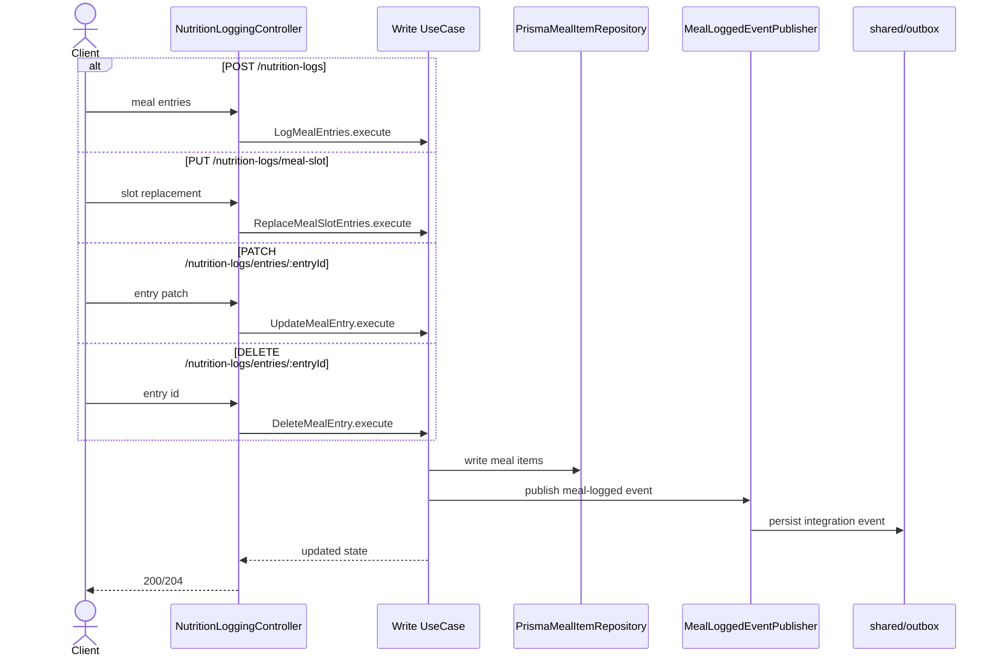
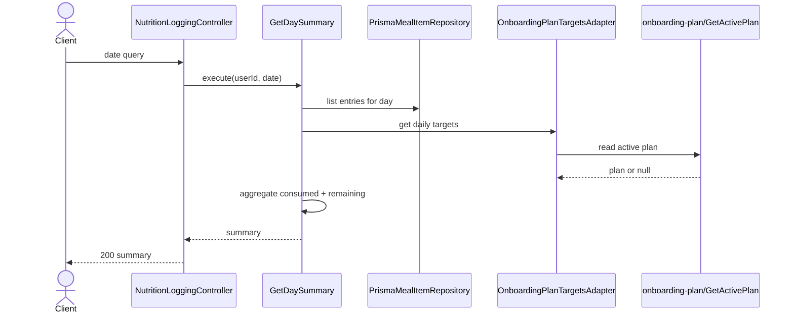

# Nutrition Logging Modulu Developer Doc

Bu modul kullanicinin ogun kayitlarini yazar, gunceller, siler ve gunluk ozeti hesaplar. Veri sahipligi bu moduldedir; diger moduller meal log bilgisini bu modulu okuyarak veya event uzerinden tuketir.

## Mimari Ozeti

- `http/NutritionLoggingController.ts` request validation ve HTTP mapping yapar.
- `use-cases/` altinda yazma akislari (`LogMealEntries`, `ReplaceMealSlotEntries`, `UpdateMealEntry`, `DeleteMealEntry`) ve okuma akislari (`GetDaySummary`, `GetLoggedMealTypesForDateRange`) bulunur.
- `domain/` toplam, kalan kalori ve ilerleme hesaplarini saf fonksiyonlarla tutar.
- `ports/MealItemRepositoryPort.ts` veri erisimini, `DailyTargetsPort.ts` aktif hedef okumayi soyutlar.
- `events/publishers/MealLoggedEventPublisher.ts` outbox event yazarak body-analytics gibi downstream modullere veri acar.

## Endpointler

| Method | Path | Aciklama |
| --- | --- | --- |
| `POST` | `/nutrition-logs` | Bir ogune yeni entry ekler |
| `PUT` | `/nutrition-logs/meal-slot` | Bir meal slot'taki tum entry'leri replace eder |
| `GET` | `/nutrition-logs/day-summary` | Belirli gun icin ozet ve hedef ilerlemesi doner |
| `PATCH` | `/nutrition-logs/entries/:entryId` | Tek bir entry'yi gunceller |
| `DELETE` | `/nutrition-logs/entries/:entryId` | Tek bir entry'yi siler |

## Sequence Diagramlari

### Yazma endpointleri



### `GET /nutrition-logs/day-summary`



## Gelistirme Rehberi

- `nutrition-logging` yazma yolunda source of truth client'in gonderdigi normalize edilmis meal data'dir. Bu modul icinden `food-recognition` sonucunu tekrar fetch etmeyin.
- Ozet hesaplarinda cache veya precomputed counter eklemeden once domain fonksiyonlarini koruyun; mevcut tasarim her istekte DB verisinden yeniden hesaplar.
- Diger moduller meal log verisine ihtiyac duydugunda repository import etmek yerine mevcut use-case veya event/read-model pattern'ini kullanin.
- Yeni yazma akisi ekliyorsaniz event publisher'i atlamayin; body-analytics read-model senkronu outbox uzerinden calisiyor.

## Ornek Best Practice

Dogru:

```ts
await logMealEntries.execute({
  userId,
  date,
  mealType: "breakfast",
  entries,
});
```

Yanlis: bir endpoint icinde toplam kalori counter'ini ayri bir tabloda arttirmak veya baska modullere callback atmak.
