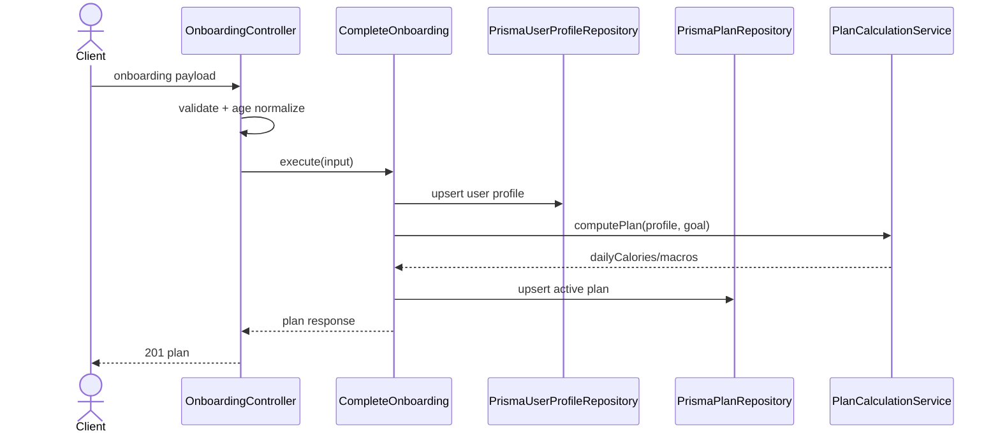

# Onboarding Plan Modulu Developer Doc

Bu modul kullanicinin ilk profil ve hedef bilgilerini alir, ardindan gunluk plani hesaplayip kaydeder. Modulin cekirdegi `CompleteOnboarding` ve paylasilan `PlanCalculationService` uzerine kuruludur.

## Mimari Ozeti

- `http/OnboardingController.ts` onboarding payload'ini validate eder ve `dateOfBirth -> age` donusumunu yapar.
- `use-cases/` altinda onboarding akisi, plan okuma/guncelleme ve profil guncelleme use-case'leri bulunur.
- `domain/` altinda plan hesaplama ve ilgili kurallar yer alir.
- `adapters/repository/` Prisma tabanli `UserProfile` ve `Plan` repository implementasyonlarini saglar.

## Endpointler

| Method | Path | Aciklama |
| --- | --- | --- |
| `POST` | `/onboarding/complete` | Profil ve hedef verisini kaydeder, aktif plani olusturur |

## Sequence Diagramlari

### `POST /onboarding/complete`



## Gelistirme Rehberi

- Yeni plan kurali ekleyecekseniz once `shared/domain/PlanCalculationService.ts` veya ilgili `domain/` fonksiyonlarina ekleyin; controller seviyesinde hesap yapmayin.
- `UserProfile` ve `Plan` bu modulin sahip oldugu veriler. Diger moduller bu tablolara dogrudan yazmamalidir; `GetActivePlan`, `UpdatePlan`, `UpdateProfileMeasurements` gibi public use-case'ler kullanilmalidir.
- `dateOfBirth`, `age`, `targetWeightKg` gibi alanlar eklendiginde once controller validation sonra repository mapping guncellenmeli; ikisinden birini bos birakmayin.
- Profil guncellemesi ile plan hesaplamasini ayri kavramlar olarak koruyun. Profil tablosuna yazmak planin yeniden hesaplanmasini gerektiriyorsa bunu use-case seviyesinde tetikleyin.

## Ornek Best Practice

Dogru genisletme yaklasimi:

```ts
await updateProfileMeasurements.execute(userId, { heightCm: 182 });
await updatePlan.execute(userId, { weeklyPaceKg: 0.4 });
```

Yanlis yaklasim: baska bir modulden `PrismaPlanRepository` import edip `Plan` satirini dogrudan update etmek.
