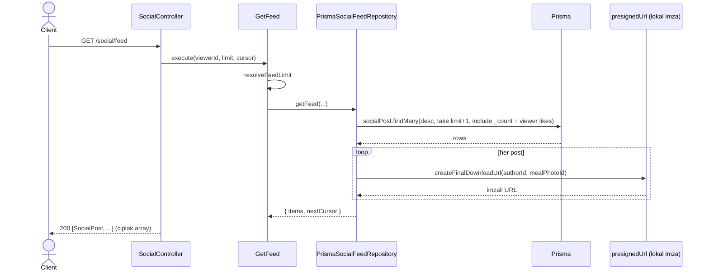
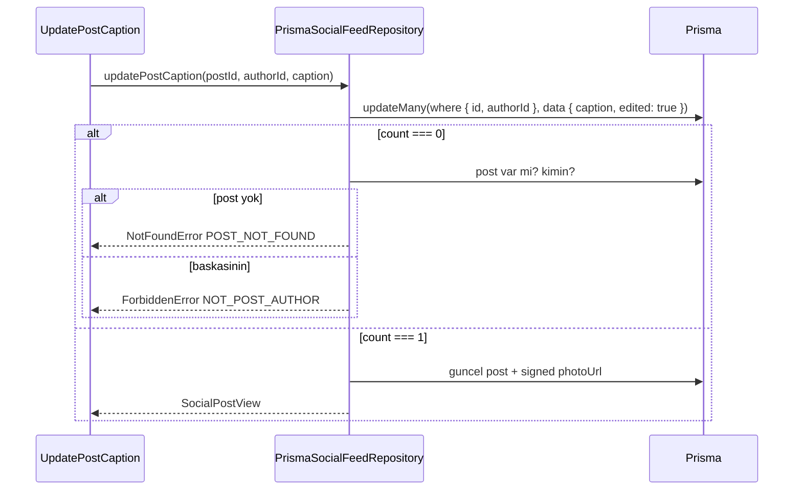

# Social Modulu Developer Doc

Basit, foto-oncelikli bir yemek feed'i. Kullanici **zaten logladigi** bir ogun
fotografini feed'e public yapar, altina kisa bir not yazar; digerleri begenir ve
yorum yapar (tek seviye reply). Modul goruntu byte'i tutmaz — sadece R2'deki
mevcut objeye referans verir.

## Fotograf modeli (onemli)

- Bir `SocialPost` bir `mealPhotoId` tasir. Bu id, `food-recognition` akisindan
  gelen `FoodEntry.id` ile aynidir ve R2'de `users/{authorId}/meals/{mealPhotoId}.jpg`
  yolundaki standardize edilmis objeye karsilik gelir.
- Feed/post okurken adapter, `createFinalDownloadUrl(authorId, mealPhotoId)` ile
  **kisa omurlu imzali GET URL** uretir (`shared/storage/presignedUrl`). Bu islem
  tamamen lokal imzalama — network yok.
- URL her zaman `authorId` yolu ile uretildigi icin, baska birinin `mealPhotoId`'sini
  gondermek yalnizca **kendi** kirik goruntune yol acar — baskasinin fotografi
  sizmaz. Bu yuzden create'te ayrica R2 existence kontrolu yapilmaz.
- Fotograf henuz islenmediyse / silindiyse imzali URL 404 verir; mobil placeholder
  gosterir ve sonraki feed refresh'te toparlar. `photoUrl` view'da `string | null`.
- **Beslenme**: `SocialPostView.nutrition` = paylasilan ogunun kalori + makro toplami
  (`{calories, proteinG, carbsG, fatG}` veya `null`). `mealPhotoId == FoodEntry.id`
  oldugu icin adapter `food_entries.resultJson`'i (status `completed`) okuyup
  `parseNutrition` ile toplar. Feed'de tek batch sorgu (`nutritionFor(ids)`).

## Mimari Ozeti

- `domain/SocialContent.ts` — urun kurallari: caption/comment normalizasyonu +
  limitleri, `deriveAuthorHue` (userId -> stabil 0..359, FNV-1a),
  `resolveAuthorName` (name -> username -> email local-part -> "Someone"),
  `resolveFeedLimit`. Prisma/HTTP yok.
- `ports/SocialFeedRepositoryPort.ts` — modulun konustugu tek port. Post, yorum ve
  iki like tablosunun sahibi. Donen her view zaten `viewerId` icin cozulmustur
  (`likedByMe` / `isMine` set, yazar adi + `photoUrl` ekli).
- `use-cases/` — endpoint basina bir ince use-case. `userId` guard'i yok
  (`authMiddleware` garantiliyor — kod tabaninin genel konvansiyonu). Gercek
  dogrulama domain fonksiyonlarinda ve Zod'da.
- `adapters/repository/PrismaSocialFeedRepository.ts` — port'un Prisma
  implementasyonu. Sayilar `_count` ile; `likedByMe` viewer-scoped `likes`
  include ile; sahiplik ownership-scoped `updateMany`/`deleteMany` + `count === 0`
  teshisi ile (404 vs 403); like toggle idempotent (`applyLike` helper P2002/P2025
  yutar); `photoUrl` `createFinalDownloadUrl` ile.
- `http/SocialController.ts` + `socialRoutes.ts` — Zod body dogrulama,
  `authMiddleware` her route'ta, DI wiring routes dosyasinda.
- `test-utils/fakes/InMemorySocialFeedRepository.ts` — use-case testleri icin.

## Response sekilleri

- `GET /social/feed` ve `GET /social/posts/:postId/comments` **ciplak JSON array**
  doner (mobil `_asList(res.data)`). Feed use-case'i `{ items, nextCursor }` uretir
  ama controller sadece `items`'i yazar — paging mobile'a gelince controller
  wrapped sekle gecer.
- Diger endpoint'ler tekil obje (`SocialPost` / `SocialComment`) doner.

## Endpointler

Hepsi `authMiddleware` arkasinda; `req.auth.userId` viewer/author.

| Method | Path | Aciklama |
| --- | --- | --- |
| `GET` | `/social/feed?limit=&cursor=` | Yeniden eskiye post listesi (ciplak array) |
| `POST` | `/social/posts` | Bir ogun fotografini paylas — `{ mealPhotoId, caption? }` -> 201 |
| `GET` | `/social/posts/:postId` | Tek post |
| `PATCH` | `/social/posts/:postId` | Kendi post'unun notunu duzenle — `{ caption }` |
| `DELETE` | `/social/posts/:postId` | Kendi post'unu sil -> 204 |
| `POST` | `/social/posts/:postId/like` | Begeni ac/kapat — `{ liked }` (idempotent) |
| `GET` | `/social/posts/:postId/comments` | Post'un tum yorumlari, eskiden yeniye (ciplak array) |
| `POST` | `/social/posts/:postId/comments` | Yorum / reply ekle — `{ text, parentId? }` -> 201 |
| `POST` | `/social/comments/:commentId/like` | Yorum begenisi ac/kapat — `{ liked }` (idempotent) |

### Hata kodlari

| Kod | HTTP | Ne zaman |
| --- | --- | --- |
| `INVALID_BODY` / `INVALID_QUERY` | 400 | Zod dogrulamasi basarisiz |
| `CAPTION_TOO_LONG` / `COMMENT_EMPTY` / `COMMENT_TOO_LONG` / `INVALID_LIMIT` | 400 | Icerik kurallari |
| `POST_NOT_FOUND` / `COMMENT_NOT_FOUND` / `PARENT_COMMENT_NOT_FOUND` | 404 | Kayit yok |
| `NOT_POST_AUTHOR` | 403 | Baskasinin post'unu duzenleme/silme |
| `MEAL_PHOTO_ALREADY_SHARED` | 403 | Ayni fotograf zaten feed'de (`@@unique`) |

## Veri Modeli

`schema.prisma`: `social_posts`, `social_comments`, `social_post_likes`,
`social_comment_likes`. Tum FK'lar `ON DELETE CASCADE` (post silinince yorum+like;
yorum silinince reply+like; user silinince hepsi). Like tablolari composite
`@@id` ile bir kullanici bir seyi bir kez begenir. `social_posts` uzerinde
`@@unique([authorId, mealPhotoId])`. Migration: `20260829120000_add_social_tables`.

## Sequence Diagramlari

### `GET /social/feed`



### `PATCH /social/posts/:postId` (sahiplik)



## Gelistirme Rehberi

- Sahiplik kontrolu **adapter'da** kalir; use-case satiri yeniden okumaz.
- Like/comment sayilarini kolonda materialize etmeyin — `_count`.
- Yeni bir icerik kurali `domain/SocialContent.ts` icine; HTTP/Prisma sizmasin.
- Feed'e alan eklerken `SocialPostView` (domain) + mobil `SocialPost.fromJson`
  ayni anda. Tek referans: `mobile/docs/social-backend-contract.md`.
- `report` / `hide` mobilde lokal no-op; moderasyon backend'i yok.

## Ornek Best Practice

Dogru — repo viewer-cozulmus view doner (photoUrl dahil), controller sekillendirir:

```ts
const page = await getFeed.execute({ viewerId: req.auth!.userId, limit, cursor });
res.status(200).json(page.items); // ciplak array
```

Yanlis: controller'da Prisma/R2 cagirmak, use-case'de `req` kullanmak,
`likedByMe`'yi ikinci sorguyla hesaplamak, ya da create'te R2'ye senkron
HeadObject atmak.
