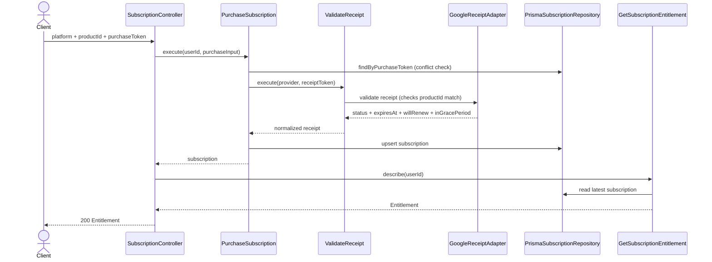
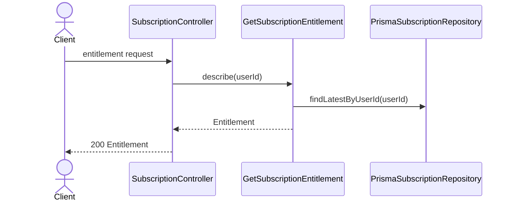

# Subscription Modulu Developer Doc

Bu modul mobil odeme makbuzlarini (Google Play Billing purchaseToken) validate eder, abonelik kaydini saklar ve premium entitlement hesabini sunar. Wire-level sozlesme icin bkz. `subscription-backend-contract.md`.

## Mimari Ozeti

- `http/SubscriptionController.ts` request/response'u `subscription-backend-contract.md`'deki Entitlement seklinde tasir.
- `use-cases/PurchaseSubscription.ts` satin alma akisini (+ purchaseToken conflict kontrolu), `ValidateReceipt.ts` provider dogrulamasini, `GetSubscriptionEntitlement.ts` premium kararini tasir.
- `ports/ReceiptValidatorPort.ts` ve `SubscriptionRepositoryPort.ts` provider ve kalicilik bagimliliklarini soyutlar.
- `adapters/billing/GoogleReceiptAdapter.ts` Google Play Developer API'ye (subscriptionsv2.get) baglanir, `AppleReceiptAdapter.ts` henuz stub (Android-only, bkz kontrat). `adapters/repository/PrismaSubscriptionRepository.ts` DB yazimini yapar.
- `use-cases/ProcessGooglePlayRtdn.ts` + `jobs/processPlayRtdnJob.ts`: Google'in Real-time Developer Notifications webhook'unu isler.

## Endpointler

| Method | Path | Aciklama |
| --- | --- | --- |
| `POST` | `/subscription/verify` | purchaseToken'i dogrular, abonelik kaydini olusturur/gunceller, Entitlement doner |
| `GET` | `/subscription/entitlement` | Cagiranin guncel Entitlement'ini doner (hic abone olmamis kullanici icin free shape) |
| `POST` | `/subscription/play-rtdn` | Cloud Pub/Sub push endpoint'i (authMiddleware yok — OIDC token GooglePubSubVerifier ile dogrulanir) |

`POST /verify` ve `GET /entitlement` ayni JSON seklini doner:

```json
{ "isPremium": true, "productId": "premium_yearly", "expiresAt": "2027-01-01T00:00:00.000Z", "willRenew": true, "inGracePeriod": false }
```

## Sequence Diagramlari

### `POST /subscription/verify`



### `GET /subscription/entitlement`



## Gelistirme Rehberi

- Yeni billing provider eklerken `ReceiptValidatorPort` implement edin; controller veya `PurchaseSubscription` icine provider switch logic'i yaymayin.
- Premium kararini UI endpointlerinde tekrar hesaplamayin. `GetSubscriptionEntitlement` tek kaynak olmali (`execute()` boolean icin — `modules/me` bu imzaya bagimli —, `describe()` tam Entitlement sekli icin).
- Repository'de son abonelik kaydi ve normalized status mantigini sabit tutun; raw provider response'u ust katmanlara sizdirmayin — `willRenew`/`inGracePeriod` bile Google'in state'inden `MapGooglePlayState`'te turetilir, adapter disina raw `subscriptionState` string'i cikmaz.
- RTDN bildirimi asla state icin guvenilir kaynak degildir — her zaman Google'a tekrar sorulur (bkz `processPlayRtdnJob.ts`).

## Ornek Best Practice

Dogru:

```ts
const validateReceipt = new ValidateReceipt(new AppleReceiptAdapter(), new ResilientGoogleReceiptAdapter(new GoogleReceiptAdapter()));
```

Yanlis: `SubscriptionController` icinde provider'a gore HTTP request atmak veya `isPremium` kararini path bazli elle hesaplamak.
