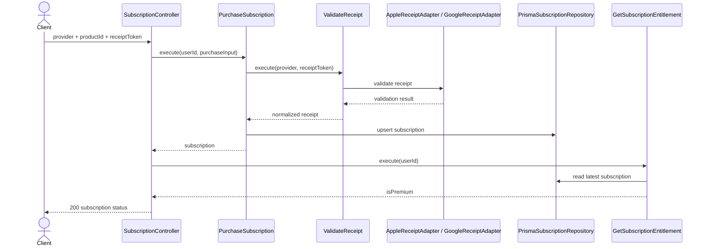
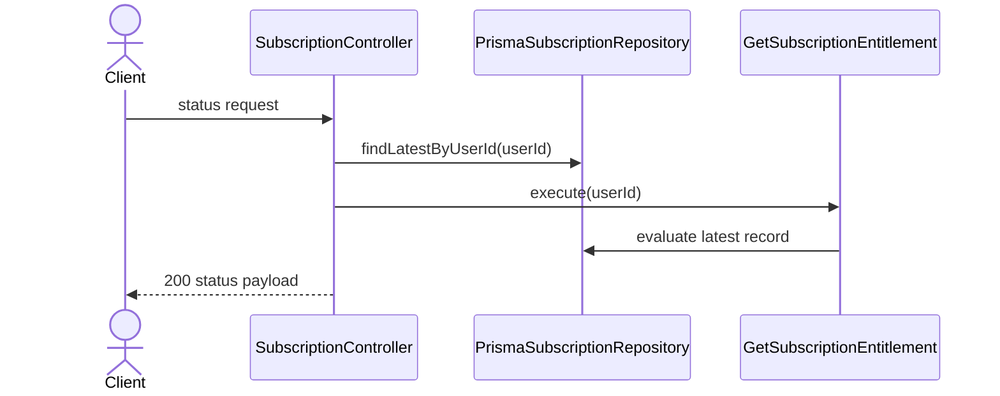

# Subscription Modulu Developer Doc

Bu modul mobil odeme makbuzlarini validate eder, abonelik kaydini saklar ve premium entitlement hesabini sunar. Provider farklarini adapter katmaninda izole eder.

## Mimari Ozeti

- `http/SubscriptionController.ts` receipt payload validation ve response shaping yapar.
- `use-cases/PurchaseSubscription.ts` satin alma akisini, `ValidateReceipt.ts` provider dogrulamasini, `GetSubscriptionEntitlement.ts` premium kararini tasir.
- `ports/ReceiptValidatorPort.ts` ve `SubscriptionRepositoryPort.ts` provider ve kalicilik bagimliliklarini soyutlar.
- `adapters/billing/AppleReceiptAdapter.ts` ve `GoogleReceiptAdapter.ts` provider baglantilarini, `adapters/repository/PrismaSubscriptionRepository.ts` DB yazimini yapar.

## Endpointler

| Method | Path | Aciklama |
| --- | --- | --- |
| `POST` | `/subscription/purchase` | Receipt validate edip abonelik kaydini olusturur/gunceller |
| `GET` | `/subscription/status` | Son abonelik kaydi ve premium durumunu doner |

## Sequence Diagramlari

### `POST /subscription/purchase`



### `GET /subscription/status`



## Gelistirme Rehberi

- Yeni billing provider eklerken `ReceiptValidatorPort` implement edin; controller veya `PurchaseSubscription` icine provider switch logic'i yaymayin.
- Premium kararini UI endpointlerinde tekrar hesaplamayin. `GetSubscriptionEntitlement` tek kaynak olmali.
- Repository'de son abonelik kaydi ve normalized status mantigini sabit tutun; raw provider response'u ust katmanlara sizdirmayin.

## Ornek Best Practice

Dogru:

```ts
const validateReceipt = new ValidateReceipt(new AppleReceiptAdapter(), new GoogleReceiptAdapter());
```

Yanlis: `SubscriptionController` icinde provider'a gore HTTP request atmak veya `isPremium` kararini path bazli elle hesaplamak.
